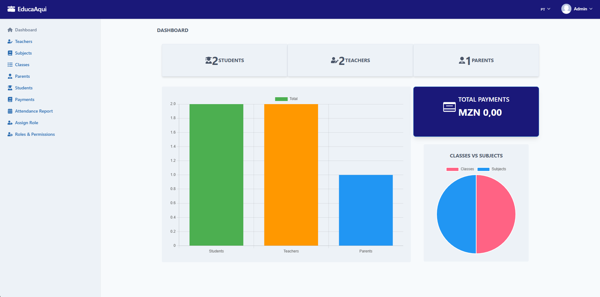
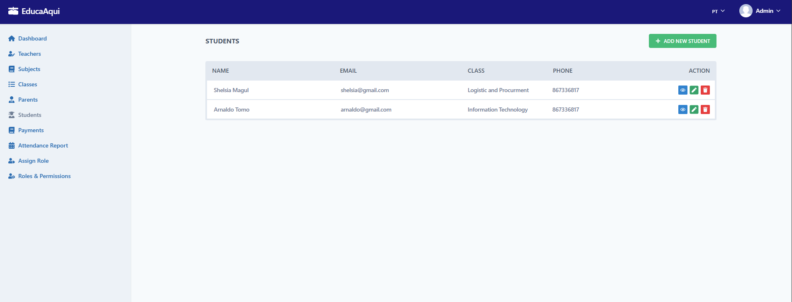
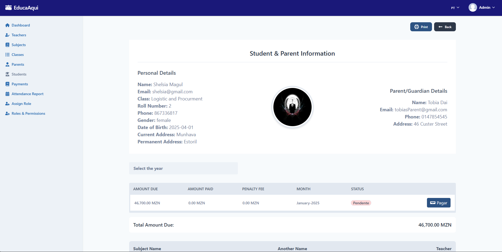

# 📚 Sistema de Gestão Escolar - EducaAqui

Este é um sistema de gestão escolar desenvolvido para auxiliar na administração de matrículas, propinas, turmas, professores e estudantes. O sistema permite um controle eficiente das operações acadêmicas e financeiras da instituição.

## 🚀 Tecnologias Utilizadas

- **Backend:** Laravel (PHP)
- **Frontend:**  Tailwind Css, JavaScript, FlowBite, Html5, Css
- **Banco de Dados:** MySQL
- **Outras Tecnologias:** JavaScript puro para filtragem de propinas

## ⚙️ Funcionalidades

- Gerenciamento de cursos e disciplinas
- Cadastro e gerenciamento de estudantes
- Controle de matrículas e mensalidades
- Cálculo automático de propinas e multas
- Filtragem de propinas por ano sem recarregar a página
- Painel administrativo para gerenciamento completo da escola
- Autenticação de usuários e permissões

## 📸 Capturas de Tela

### 📌 Página Inicial


### 📌 Gestão de Estudantes


### 📌 Controle de Propinas


## 📂 Estrutura do Projeto
```
📁 sistema-escolar
 ├── 📂 app
 │   ├── Controllers
 │   ├── Models
 │   └── Views
 ├── 📂 database
 │   ├── migrations
 │   ├── seeders
 ├── 📂 public
 │   ├── images
 ├── 📂 resources
 │   ├── views
 │   ├── livewire
 ├── 📂 routes
 │   ├── web.php
 ├── 📂 storage
 ├── 📂 tests
 ├── .env.example
 ├── composer.json
 ├── package.json
 ├── README.md
```

## 🛠️ Instalação

1. Clone o repositório:
```bash
  git clone https://github.com/restenPiz/school-laravel.git
  cd school-laravel
```

2. Instale as dependências do Laravel:
```bash
  composer install
```

3. Configure o arquivo `.env`:
```bash
  cp .env.example .env
  php artisan key:generate
```

4. Configure o banco de dados no `.env` e execute as migrações:
```bash
  php artisan migrate --seed
```

5. Inicie o servidor:
```bash
  php artisan serve
```

## 🎯 Próximos Passos

- Implementar novos relatórios financeiros
- Melhorar a interface com componentes Vue.js
- Adicionar integração com sistemas de pagamento

## 🤝 Contribuição

Contribuições são bem-vindas! Para contribuir:
1. Faça um fork do projeto
2. Crie uma branch para sua funcionalidade: `git checkout -b minha-feature`
3. Faça commit das mudanças: `git commit -m 'Adicionei uma nova funcionalidade'`
4. Envie para o repositório: `git push origin minha-feature`
5. Abra um Pull Request

## 📜 Licença

Este projeto é licenciado sob a [MIT License](LICENSE).

---

🔗 **Desenvolvido por Mauro Peniel**
